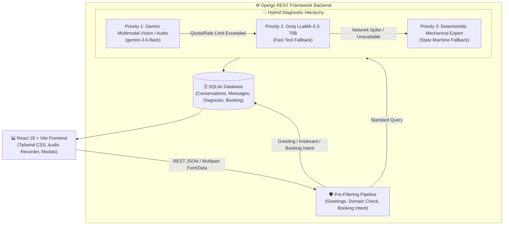

# 🏎️ CarBuddy V2 — AI Car Mechanic Chatbot

[](https://www.python.org/)
[](https://www.djangoproject.com/)
[](https://react.dev/)
[](https://tailwindcss.com/)
[](https://vitejs.dev/)
[](LICENSE)

An intelligent, full-stack web application where car owners can chat with a virtual senior automotive mechanic agent for vehicle troubleshooting, on-demand multimodal inspection (images, audio, video), actionable provisional diagnosis, and doorstep mechanic service bookings.

---

## 📌 Deliverables & Live Links

| Deliverable | Link / Location |
| :--- | :--- |
| **Live Frontend URL** | [https://automate-ai.vercel.app](https://automate-ai.vercel.app) *(or your deployed Vercel URL)* |
| **Live Backend API URL** | [https://carbuddy-v2-backend.onrender.com](https://carbuddy-v2-backend.onrender.com) |
| **API Health Check** | `GET /api/health/` → [https://carbuddy-v2-backend.onrender.com/api/health/](https://carbuddy-v2-backend.onrender.com/api/health/) |
| **GitHub Repository** | [https://github.com/vinit-4209/CarBuddy-V2](https://github.com/vinit-4209/CarBuddy-V2) |
| **Frontend Documentation** | [`frontend/README.md`](frontend/README.md) |
| **Backend Documentation** | [`backend/README.md`](backend/README.md) |

---

## 📑 Table of Contents

- [🏗️ System Architecture](#️-system-architecture)
- [⚡ Minimizing Unnecessary AI Usage](#-minimizing-unnecessary-ai-usage)
- [🤖 Bot Behaviour & Personas](#-bot-behaviour--personas)
- [📡 REST API Documentation](#-rest-api-documentation)
- [🚀 Quickstart & Setup Instructions](#-quickstart--setup-instructions)
  - [Backend Setup (Django & DRF)](#backend-setup-django--drf)
  - [Frontend Setup (React & Vite)](#frontend-setup-react--vite)
- [🌐 Cloud Deployment Guide](#-cloud-deployment-guide)
  - [Deploy Backend to Render](#a-deploy-backend-to-render)
  - [Deploy Frontend to Vercel](#b-deploy-frontend-to-vercel)
- [🧪 Automated Test Suite](#-automated-test-suite)
- [📊 Evaluation Criteria Compliance](#-evaluation-criteria-compliance)
- [📄 License](#-license)

---

## 🏗️ System Architecture

The application is engineered with a **hybrid, multi-tier architecture** that balances state-of-the-art AI reasoning with high-performance deterministic backend logic.



---

## ⚡ Minimizing Unnecessary AI Usage

A primary criterion of the technical assessment is **minimizing unnecessary AI API usage**. CarBuddy V2 implements a 3-tier deterministic filtration system:

| Tier | Mechanism | AI Token Cost | Trigger Condition |
| :---: | :--- | :---: | :--- |
| **Tier 1** | **Greeting Short-Circuit** | **0 Tokens** | Greetings ("Hi", "Hello", "Good morning") return instant mechanic persona greetings. |
| **Tier 2** | **Automotive Domain Filter** | **0 Tokens** | Unrelated topics (cooking recipes, geography trivia, coding) are politely rejected without invoking AI. |
| **Tier 3** | **Booking Router** | **0 Tokens** | Customer intent to book ("yes book", "schedule appointment") directly routes to booking without consuming AI tokens. |
| **Tier 4** | **On-Demand Multimodal AI** | **Targeted** | Gemini AI is only engaged for actual diagnostic reasoning, vehicle sound listening, or photo inspection. |
| **Tier 5** | **Deterministic Rule Fallback** | **0 Tokens** | If AI quotas or network delays spike, the internal mechanical state machine provides actionable diagnostic reports. |

> [!TIP]
> In the chat interface, every assistant response displays an **Attribution Badge** (e.g. `⚡ Local Rule Engine (0 AI Calls)` or `🧠 Gemini Multimodal AI`), visually proving that AI calls are systematically minimized.

---

## 🤖 Bot Behaviour & Personas

- **Senior Automobile Technician Persona:** Speaks with polite, experienced authority, focusing on safety, root causes, and practical inspections.
- **Automotive-Only Scope:** Strictly bound to vehicles, mechanical components, warning lights, maintenance, and car troubleshooting.
- **Follow-up Before Diagnosis:** Automatically asks 1–2 clarifying questions to narrow down conditions (e.g. *"Does it happen at idle or while moving?"*) before issuing a diagnosis.
- **On-Demand Media Analysis:** Image/audio/video uploads are **never compulsory**. Users can chat purely via text or attach files at any turn.
- **Actionable Service Recommendations:** Diagnoses always include provisional confidence levels, likely causes, recommended repairs, and safety warnings.
- **Doorstep Booking Integration:** When the customer agrees, CarBuddy guides them to book a certified technician via the integrated booking engine.

---

## 📡 REST API Documentation

### 1. Health Check
* **Endpoint:** `GET /api/health/`
* **Description:** Verifies backend health and server availability.
* **Response (200 OK):**
```json
{
  "status": "success",
  "message": "CarBuddy V2 backend is running"
}
```

---

### 2. Diagnostic Chat
* **Endpoint:** `POST /api/chat/`
* **Description:** Multi-turn conversational diagnosis with AI engine attribution.
* **Request Payload:**
```json
{
  "message": "My 2018 Honda Civic engine is overheating when idling in traffic",
  "conversation_id": 1,
  "media_ids": [15]
}
```
* **Response (Follow-up Turn - 200 OK):**
```json
{
  "success": true,
  "conversation_id": 1,
  "engine": "gemini",
  "engine_label": "Gemini 3.6 Flash",
  "user_message": { "id": 12, "content": "My 2018 Honda Civic engine is overheating...", "role": "user" },
  "assistant_message": { "id": 13, "content": "Have you noticed if the radiator cooling fan spins when stopped?", "role": "assistant" },
  "is_automotive": true,
  "needs_followup": true,
  "followup_question": "Have you noticed if the radiator cooling fan spins when stopped?",
  "diagnosis_ready": false
}
```
* **Response (Diagnosis Ready - 200 OK):**
```json
{
  "success": true,
  "conversation_id": 1,
  "engine": "gemini",
  "engine_label": "Gemini 3.6 Flash",
  "diagnosis_ready": true,
  "diagnosis_id": 4,
  "diagnosis": "Radiator Cooling Fan Failure or Defective Fan Relay",
  "confidence": 92.0,
  "severity": "high",
  "symptoms": ["Engine overheating during idle", "Cooling system fails to regulate temperature at stoplights"],
  "possible_causes": ["Burnt out fan motor", "Blown fan relay / fuse", "ECT sensor fault"],
  "recommended_service": "Radiator Fan Motor & Relay Inspection / Replacement",
  "safety_warning": "Avoid driving in red temperature zone to prevent cylinder head warpage."
}
```

---

### 3. Media Upload
* **Endpoint:** `POST /api/upload/`
* **Content-Type:** `multipart/form-data`
* **Parameters:** `file` (image, audio, video up to 20MB), `conversation_id` (optional).
* **Response (201 Created):**
```json
{
  "success": true,
  "conversation_id": 1,
  "message": {
    "id": 15,
    "conversation_id": 1,
    "media_type": "image",
    "file_name": "radiator_leak.jpg",
    "file_size": 245100,
    "url": "http://127.0.0.1:8000/media/conversations/2026/09/24/radiator_leak.jpg"
  }
}
```

---

### 4. Fetch or Generate Diagnosis
* **Endpoint:** `POST /api/diagnosis/`
* **Request Payload:** `{"conversation_id": 1}`
* **Response (200 OK):**
```json
{
  "success": true,
  "diagnosis": {
    "id": 4,
    "conversation": 1,
    "title": "Radiator Cooling Fan Failure / Relay Malfunction",
    "severity": "high",
    "confidence": 92.0,
    "symptoms": ["Overheating in traffic"],
    "possible_causes": ["Fan motor failure", "Faulty relay"],
    "recommended_service": "Radiator Fan Replacement",
    "safety_notes": "Do not drive with engine in red temperature zone."
  }
}
```

---

### 5. Create Mechanic Booking
* **Endpoint:** `POST /api/booking/`
* **Request Payload:**
```json
{
  "diagnosis_id": 4,
  "customer_name": "John Doe",
  "phone": "+91 9876543210",
  "email": "john@example.com",
  "vehicle": "2018 Honda Civic",
  "service": "Radiator Fan Replacement",
  "address": "Flat 402, High Street",
  "city": "Mumbai",
  "pincode": "400050",
  "preferred_date": "2026-09-26",
  "preferred_time": "11:00:00"
}
```
* **Response (201 Created):**
```json
{
  "success": true,
  "message": "Mechanic booking created successfully.",
  "booking": {
    "id": 1,
    "diagnosis_id": 4,
    "customer_name": "John Doe",
    "vehicle": "2018 Honda Civic",
    "service": "Radiator Fan Replacement",
    "preferred_date": "2026-09-26",
    "preferred_time": "11:00:00",
    "status": "confirmed",
    "created_at": "2026-09-24T05:41:07.500098Z"
  }
}
```

---

### 6. Get Booking Details
* **Endpoint:** `GET /api/booking/{id}/`
* **Response (200 OK):**
```json
{
  "success": true,
  "booking": {
    "id": 1,
    "customer_name": "John Doe",
    "phone": "+91 9876543210",
    "vehicle": "2018 Honda Civic",
    "service": "Radiator Fan Replacement",
    "address": "Flat 402, High Street",
    "city": "Mumbai",
    "status": "confirmed"
  }
}
```

---

## 🚀 Quickstart & Setup Instructions

### Prerequisites
- Python 3.10+
- Node.js 18+ & npm
- Git

---

### Backend Setup (Django & DRF)

```bash
# 1. Navigate to backend directory
cd backend

# 2. Create and activate a virtual environment
python -m venv venv
# Windows:
.\venv\Scripts\Activate.ps1
# macOS / Linux:
source venv/bin/activate

# 3. Install dependencies
pip install -r requirements.txt

# 4. Configure environment (.env)
# Create backend/.env:
GEMINI_API_KEY=your_gemini_api_key_here
GROQ_API_KEY=your_groq_api_key_here

# 5. Run database migrations & staticfiles
python manage.py migrate
python manage.py collectstatic --noinput

# 6. Start development server
python manage.py runserver 127.0.0.1:8000
```
API will be live at `http://127.0.0.1:8000/api/`.

---

### Frontend Setup (React & Vite)

```bash
# 1. Navigate to frontend directory
cd frontend

# 2. Install dependencies
npm install

# 3. Configure environment (.env)
VITE_API_BASE_URL=http://127.0.0.1:8000/api

# 4. Start development server
npm run dev

# 5. Build production bundle
npm run build
```
Frontend will be live at `http://localhost:5173`.

---

## 🌐 Cloud Deployment Guide

### A. Deploy Backend to Render
1. Push repository to GitHub.
2. In [Render Dashboard](https://dashboard.render.com/), click **New +** > **Web Service**.
3. Connect your repository. Render automatically reads [`render.yaml`](render.yaml):
   - **Root Directory:** `backend`
   - **Build Command:** `./build.sh`
   - **Start Command:** `gunicorn config.wsgi:application --log-file -`
4. Set Environment Variables:
   - `DEBUG`: `False`
   - `ALLOWED_HOSTS`: `*`
   - `SECRET_KEY`: `<Generate random secret>`
   - `GEMINI_API_KEY`: `<Your Gemini Key>`
   - `GROQ_API_KEY`: `<Your Groq Key>`
5. Click **Deploy Web Service**.

> [!NOTE]
> The backend is fully compatible with both **Render** and **AWS Free Tier (EC2 `t2.micro`)** with Gunicorn and Nginx.

---

### B. Deploy Frontend to Vercel
1. In [Vercel Dashboard](https://vercel.com/), click **Add New...** > **Project**.
2. Import your GitHub repository.
3. Configure settings:
   - **Framework Preset:** `Vite`
   - **Root Directory:** `frontend`
   - **Build Command:** `npm run build`
   - **Output Directory:** `dist`
4. Add Environment Variable:
   - `VITE_API_BASE_URL`: `https://your-backend-name.onrender.com/api`
5. Click **Deploy**. SPA rewrites are automatically handled via [`frontend/vercel.json`](frontend/vercel.json).

---

## 🧪 Automated Test Suite

A complete verification script tests all 5 endpoints, domain filters, greeting shortcuts, and booking persistence:

```bash
cd backend
python test_all_endpoints.py
```

Expected output:
```
=== 1. Health Check === (Status: 200)
=== 2. Chat - Greeting (Traditional Logic) === (Status: 200)
=== 3. Chat - Irrelevant Query (Polite Rejection) === (Status: 200)
=== 4. Chat - Automotive Query (Follow-up) === (Status: 200)
=== 5. Media Upload === (Status: 201)
=== 6. Diagnosis View === (Status: 200)
=== 7. Create Booking === (Status: 201)
=== 8. Get Booking === (Status: 200)
ALL 8 TESTS PASSED SUCCESSFULLY!
```

---

## 📊 Evaluation Criteria Compliance

| Evaluation Category | How It Is Achieved |
| :--- | :--- |
| **Minimizing Unnecessary AI Usage** | 3-tier pre-filter: Instant greeting short-circuit (0 AI tokens), domain rejection (0 AI tokens), deterministic booking router (0 AI tokens), and rule-based diagnostic fallback. |
| **API Design** | RESTful design with all 5 mandatory endpoints, standard HTTP status codes (200, 201, 400, 404), and clean JSON payloads. |
| **Frontend UX** | React 18 SPA with 1-click sample prompts, in-chat voice player, clean markdown bold rendering, and printable diagnosis work orders. |
| **Multimodal Media Analysis** | Flexible on-demand upload of images, audio, and video directly analyzed by Gemini File API (`client.files.upload`). |
| **Database Design** | Relational SQLite ORM schema for `Conversation`, `Message`, `Diagnosis`, and `Booking`. |
| **Error Handling & Resilience** | Three-tier fallback: Gemini Vision → Groq LLaMA-3 → Deterministic Rule Engine so users never experience downtime. |

---

## 📄 License
MIT License. Created for the Full-Stack Developer Intern Technical Assessment.
