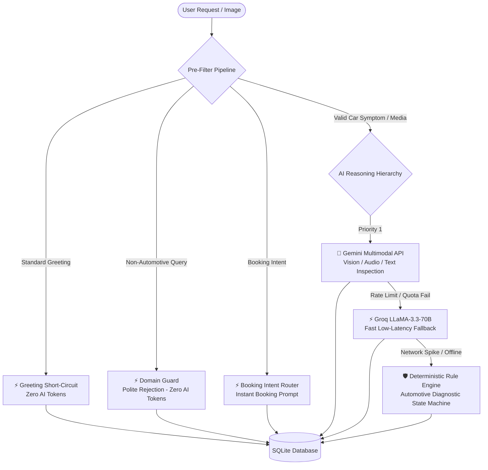

# ⚙️ CarBuddy V2 — Backend API

> Resilient, AI-minimized Django REST Framework API for vehicle mechanical troubleshooting, multimodal inspection, and doorstep service bookings.

---

## 🏗️ Architecture & AI Minimization Strategy

The backend implements a **hybrid multi-tier pipeline** specifically engineered to satisfy the intern assessment evaluation criteria: **minimizing unnecessary AI API usage** while delivering senior-mechanic diagnostic precision.



### 1. Traditional Greeting Short-Circuit (0 AI Cost)
- Common greetings ("Hi", "Hello", "Good morning") are intercepted deterministically.
- Returns instant persona greetings without spending AI tokens.

### 2. Automotive Domain Verification (0 AI Cost)
- Intercepts unrelated topics (cooking recipes, geography trivia, coding questions).
- Politely clarifies that CarBuddy is exclusively an automotive diagnostic agent.

### 3. Multimodal Analysis On Demand
- Gemini API is used only when actual vehicle mechanical diagnosis or visual/audio inspection is required.
- Files uploaded via `POST /api/upload/` are passed to Gemini's File API (`client.files.upload()`).

### 4. Deterministic Rule-Based Fallback
- If Gemini rate-limits (HTTP 429) or Groq is unavailable, a built-in mechanical troubleshooting state machine (`process_message()`) produces structured diagnostic reports with safety precautions and recommended repairs.

---

## 🛠️ Tech Stack

- **Framework**: Python 3.11+ / Django 5+ / Django REST Framework
- **Database**: SQLite3 (`db.sqlite3`)
- **WSGI Server**: Gunicorn
- **Static Assets**: WhiteNoise
- **AI SDK**: Google GenAI SDK (`google-genai`), Groq SDK (`groq`)
- **Deployment**: Render Web Service (`render.yaml`) & AWS EC2 Ready

---

## 🚀 Local Setup

```bash
# 1. Navigate to backend directory
cd backend

# 2. Create and activate virtual environment
python -m venv venv

# Windows PowerShell:
.\venv\Scripts\Activate.ps1
# Linux / macOS:
source venv/bin/activate

# 3. Install dependencies
pip install -r requirements.txt

# 4. Configure environment (.env)
# Create backend/.env with:
# GEMINI_API_KEY=your_gemini_api_key_here
# GROQ_API_KEY=your_groq_api_key_here

# 5. Run migrations & collect static
python manage.py migrate
python manage.py collectstatic --noinput

# 6. Run development server
python manage.py runserver 127.0.0.1:8000
```

---

## 📡 REST API Endpoints

| Endpoint | Method | Description |
| :--- | :---: | :--- |
| `/api/health/` | `GET` | Health check and server status. |
| `/api/chat/` | `POST` | Multi-turn conversational diagnosis with AI attribution. |
| `/api/upload/` | `POST` | Upload car photos, audio clips, or videos (up to 20MB). |
| `/api/diagnosis/` | `POST` | Fetch or generate structured vehicle diagnostic report. |
| `/api/booking/` | `POST` | Create a confirmed mechanic service booking. |
| `/api/booking/<id>/` | `GET` | Retrieve confirmed booking details. |

---

## 🧪 Automated Test Suite

Run the full end-to-end test suite covering all 5 core endpoints, multi-tier filtering, media uploads, and booking:

```bash
python test_all_endpoints.py
```

Expected output:
```
=== 1. Health Check === (Status: 200)
=== 2. Chat - Greeting (Traditional Logic) === (Status: 200)
=== 3. Chat - Irrelevant Query (Polite Rejection) === (Status: 200)
=== 4. Chat - Automotive Query (Follow-up) === (Status: 200)
=== 5. Media Upload === (Status: 201)
=== 6. Diagnosis View === (Status: 200)
=== 7. Create Booking === (Status: 201)
=== 8. Get Booking === (Status: 200)
ALL 8 TESTS PASSED SUCCESSFULLY!
```
